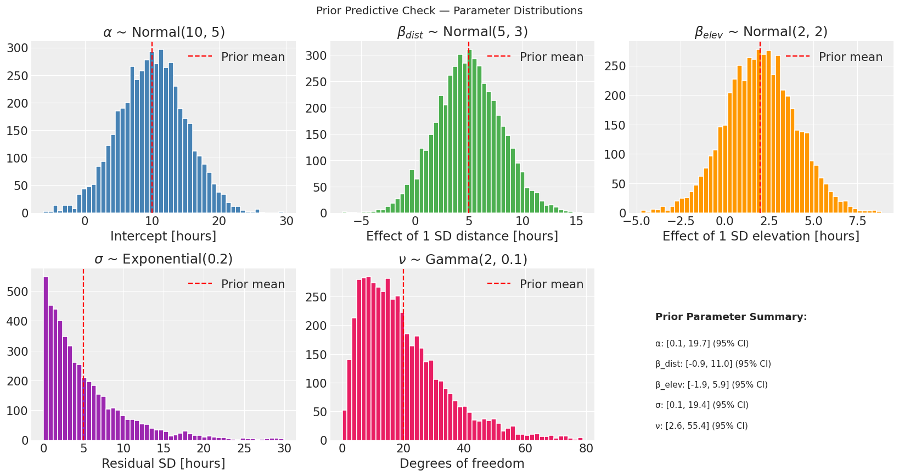

priory.
do normalengo mamy normal(10,5). czyli dalismy do priora srednia z danych, cos czego w teorii nie powinnismy zrobic. ale trzeba dopytac, bo skoro tak sie to rozklada to moze nie byc tak glupie
 